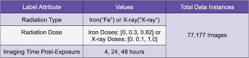
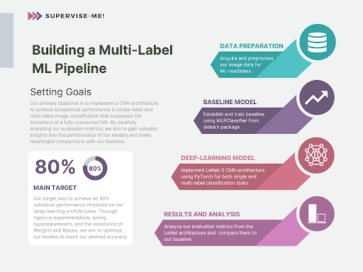
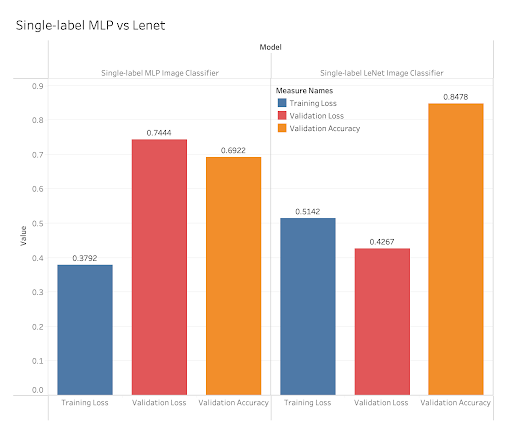
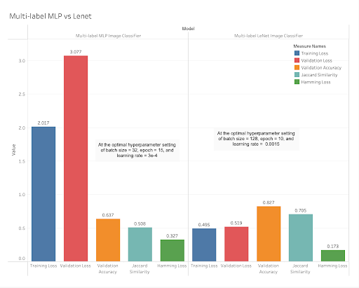

# Multi-labeling the particle type and damage intensity of mice nuclei
Creating a machine learning model that would be able to predict multi-labels of particle type and the intensity of irradiation on mice nuclei.

## Report and Externals
Summary of our findings and research:

Tech-Memo: [Supervise Me! Tech Memo](externals/techmemo_supervise_me.pdf)

Presentation: [Supervise Me! Showcase](externals/showcase_supervise_me.pdf)

## How to use?
We included two models that required training:  
* `mlp_model.py` (baseline) - Uses the MLPClassifier from sklearn.
* `lenet_scratch.py` (CNN deep-learning) - Uses a Lenet-5 CNN model built on PyTorch.

Installing dependencies:
* yaml files are in `environments/setup/*.yml`

Training the models:
* Make sure to uncomment `bps_datamodule.prepare_data()` in lenet_scratch.py to download the training image-data. The process uses boto3 and PyTorch to gather image data from AWS and transform it into ML-ready data.
* `python src/models/mlp_model.py`
* `python src/models/lenet_scratch.py`

Run `lenet_scratch.py` first to download image data.

## Overarching problem
Astronaut health - Astronauts' exposure to ionizing radiation can cause:  
* DNA damage
* Central nervous system effects
* Immune system effects  

The longer astronauts stay in space, the more likely these problems are to arise. However, it is difficult to study this problem. To be able to study and understand spaceflight-induced biological changes, we need subjects to experiment on. Conducting experiments on humans is certainly out of the question, due to a large discussion of ethical issues and risks. So how might we solve this problem?

## HOW MIGHT WE use Machine Learning to predict the particle type and amount of damage based on images of DNA damaged mice cells?
As biologically similar organisms, we can conduct experiments on mice for the benefit of humankind. This is where our dataset comes in. Our BPS Microscopy Dataset contains images of nuclei from mouse cells that are irradiated with iron or X-ray particles, and displays a marker for DNA damage.  
 
Utilizing machine learning, we want to understand the health effects of radiation exposure on astronauts to potentially discover optimal recovery paths for individuals exposed to radiation particles during space travel. We will do this through the predictions of multi-labels, specifically `<particle, dosage>`. Being able to predict multi-labels of this model will grant us valuable insights into radiation damage and patterns of between nuclei images and damage/particle types.

## Dataset details

## Machine Learning Pipeline
We needed to create a roadmap to how we were going to use machine learning on the data set.

We used boto3 to collect the dataset from AWS, and created our baseline model MLP Classifier from scikit-learn.

After forming our baseline, we moved on to use PyTorch and PyTorch Lightning to create our deep-learning CNN architecture.

We used both models to predict single and multi-labels, specifically, our models were trained to predict the particle type that damaged the cell, or the particle type and the dosage amount given.

## Results
After training our data, we log some metrics that are important to our predictions.

Single-label:

Multi-label:

We have the same metrics for multi-label as we do for single-label, except we added a couple that better represent multi-label predictions, such as Jaccard Similarity and Hamming Loss.

We achieved an 84.78% validation accuracy for our single-label predictions and a 82.7% valdiation accuracy for our multi-label predictions.

## Takeaways
Based on the results, it is clear that CNN architectures are much better suited for image classification tasks than fully connected neural networks. Additionally, this shows us that there are clear patterns between an image and its particle types and dosages.

Mice share a significant portion of their genetic makeup with humans, which makes them valuable models for studying various biological processes, diseases, and potential treatments.

Therefore, the use of mice in radiation research and mice cell data predictions may provide valuable information that contributes to addressing radiation-related challenges encountered by astronauts.

## Collaborators:
Darren Hoang (Student)  
Jake Leue (Student)  
Diya Mirji (Student)  
Thien Vu (Student)  
Nadia Ahmed (Professor)  
Dr. Lauren Sanders (NASA GeneLab Scientist and Data Provider)  
Dr. Sylvain Costes (NASA Domain Expert)
